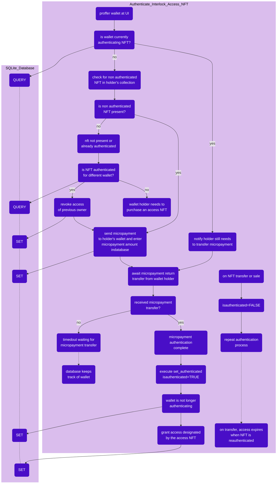

# The Interlock Access NFT

The Interlock Access NFT is a scheme for licensing and managing access permissions via ownership of a novel NFT. This project is sponsored by the [Aleph Zero](https://alephzero.org) Grant Program and is intended to provide this licensing/access scheme as a general framework to the Aleph Zero community at large. The NFT used in this project is compatible with the [Art Zero](https://artzero.io) marketplace.

This project presumes knowledge of the following:
 - [PSP43 NFT standard (ERC721)](https://github.com/w3f/PSPs/blob/master/PSPs/psp-34.md)
 - [ink! 4](https://use.ink/4.0.0-alpha.1/)
 - [openbrush 3](https://docs.openbrush.io)
 - [Polkadot{.js}](https://polkadot.js.org/docs/)
 - [SQLite](https://www.sqlite.org/index.html)

## In this repository:

You will find the following:
1) modified ink!4 openbrush3 PSP34 access NFT contract
2) suite of node.js authentication scripts
3) basic script integration into a SQLite database

As this is a _general_ framework, it will be up to you to create your own UI frontend. To see a bare bones implmentation, visit the [CLIdemo](./CLIdemo) directory. Interlock Network will add additional UI implementations as we go on implmenting various forms of this Interlock Access NFT in our own work.

## Getting started:

Visit the [CLIdemo](./CLIdemo) directory to jump straight to tinkering with the barebones access NFT scheme implementation.

## How this framework works:

A standard PSP34 NFT smart contract is repurposed by reimplementing the `transfer` method, adding the `set_authorized` and `set_not_authorized` methods, and creating a new storage space and method for tracking the _collection_ held by a particular wallet holder (`access_collection`)

When the contract owner mints an access token to a wallet holder (or if the wallet holder mints or buys a token from the Art Zero marketplace), the token is set by default to `isauthenticated=FALSE`.

Now take for example the use-case where we use the access NFT as a software license. When the NFT is in the state `isauthenticated=FALSE`, then this is equivalent to the software license not yet being registered. The NFT holder must authenticate their identity to register their access NFT software license. The reason they must authenticate their identity should be apparent: it is to prevent someone from monitoring NFT sale/mint transactions on the blockchain, then using somebody else's wallet (containing an access NFT) to claim rights to a software license that isn't rightfully theirs.

So, to authenticate their new access NFT, the holder must visit an interface (UI) where they partake in the authetication process via the backend authentication scripts.

#### From their perspective, will look like this:
1) provide wallet address
2) transfer some small specified amount of $AZERO to the contract owner (refunded)
3) submit identification information to associate with their newly authenticated license (optional)

#### Behind the scenes, will look like this:
1) check the wallet's NFT collection to make sure wallet contains at least one non authenticated access NFT
2) if so, check SQLite database to make sure wallet isn't already pending authentication transfer for that NFT
3) if not, transfer some small amount of $AZERO to the NFT holder
4) log this wallet in SQLite database as _pending authetication transfer_ plus the value of the small amount transfered
5) await transfer of specified amount from wallet holder
6) when transfer succeeds, run `set_authenticated` method to turn attribute `isauthenticated=TRUE`
7) enter authenticated wallet in database for future use (ie, to enable software access via some other backend)

#### And that's it; after authentication, the NFT holder has proven right to access whatever privilege that NFT mediates.

If at any point an NFT holder wishes to sell or transfer their access NFT to a different wallet, the reimplemented `transfer` method will reset the NFT to `isauthenticated=FALSE`.

Because the access NFT uses attributes to track authentication status, the `set_authenticated` and `set_not_authenticated` methods may seem redundant. However, these are deliberately included for logic injection points for access management that may otherwise be inappropriate for the `set_attribute` method. The contract--and logic within `set_authenticated` and `set_not_authenticated` is fully upgradable via the `set_code_hash` ink! method.

Finally, the NFT contract `access_collection` feature is added as a convenience to make bringing up a wallet holder's collection and iterating over those NFTs easier.

## Authentication process flowchart:

